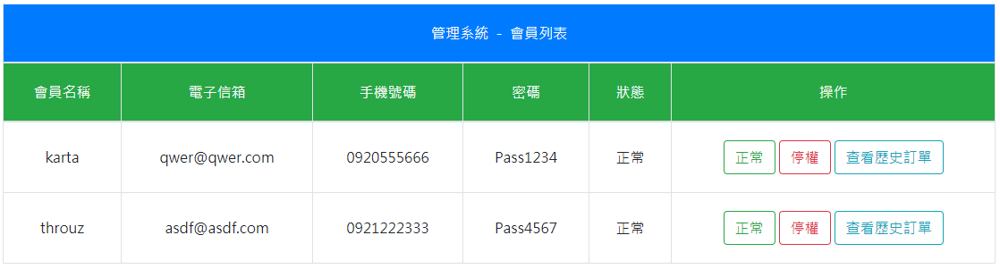

# PID-Assignment

購物車(買賣內容不限)
1. 管理端
    1. 會員管理
        1. 訂單管理:可單看該會員買的項目
        1. 會員列表:可顯示、停用會員 (停用該會員則該會員不可登入 或操作)
    1. 商品管理
        1. 商品管理:新增刪除修改商品
    1. 報表(加分題，有空再執行)
        1. 自由發揮，思考網站營運所需要的報表需可選擇區間查看
2. 會員端
    1. 註冊/登入功能
    1. 產品列表及購物車功能 2.3 可查看購買的品項

 
 
 
 
 
 
 
 
 