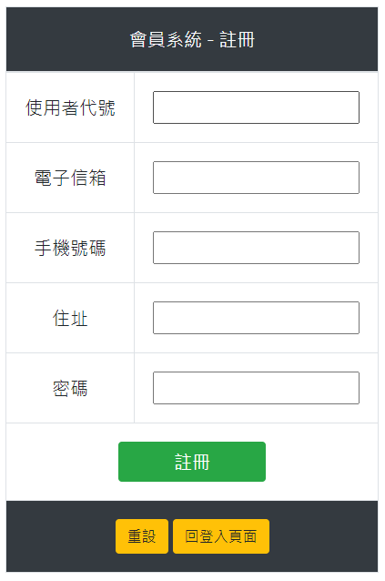
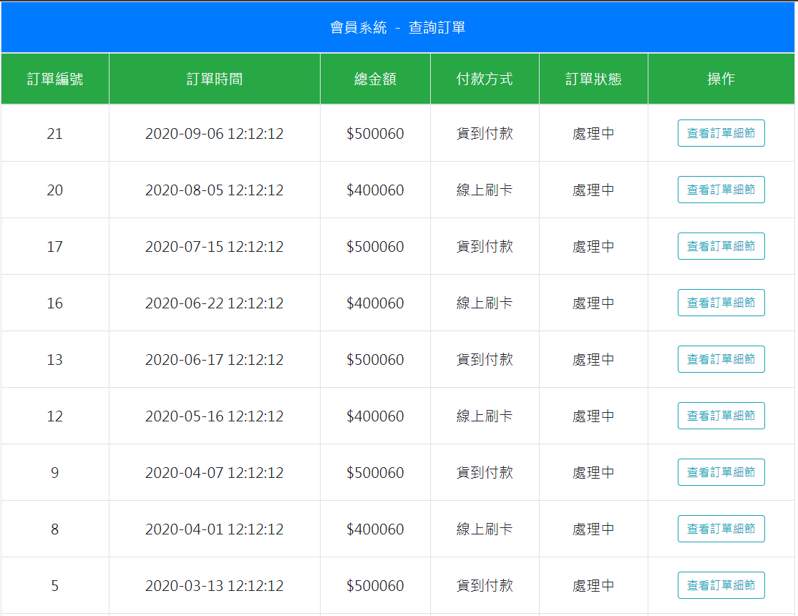
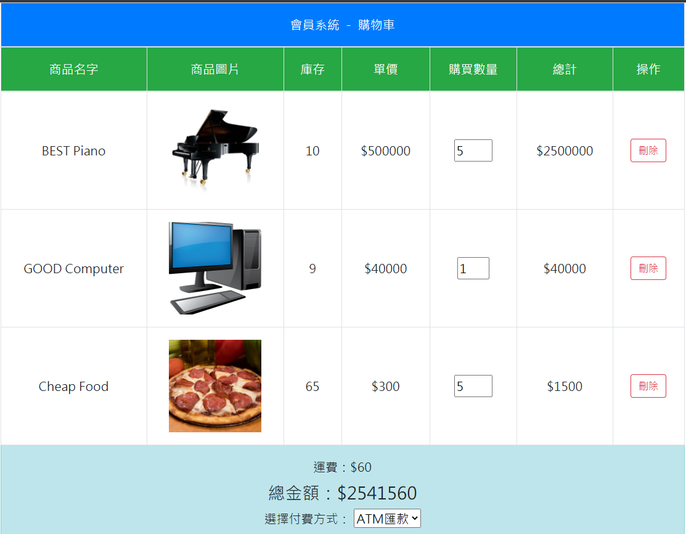

# PID-Assignment
## 管理端
### 訂單管理
1. 修改訂單狀態為已完成或已取消
1. 查看訂單細節

### 會員列表
1. 修改會員狀態為正常或停權
1. 查看會員歷史訂單
1. 查看會員歷史訂單細節

### 商品管理
1. 新增商品
1. 修改商品
1. 刪除商品

### 報表
1. 查看日營收，可選擇區間
1. 查看月營收，可選擇區間

## 會員端
### 註冊
1. 所有欄位不得為空
1. 使用者代號不得與其他使用者重複
1. 電子信箱不得與其他使用者重複
1. 手機號碼不得與其他使用者重複
1. 密碼大於8個字元，需含大小寫字母與數字

### 登入
只需使用者代號及密碼就能登入

### 商品列表
1. 可將商品加入購物車
1. 加入購物車時右上角的購物車圖示會同步購買數量

### 查詢訂單
1. 可查看歷史訂單
1. 可查看訂單狀態
1. 可查看歷史訂單細節

### 購物車
1. 可修改購買數量
1. 修改購買數量時右上角的購物車圖示會同步購買數量
1. 修改購買數量時金額會同步計算
1. 可刪除購買物品
1. 結帳時若庫存不足會購買失敗並給予提示
