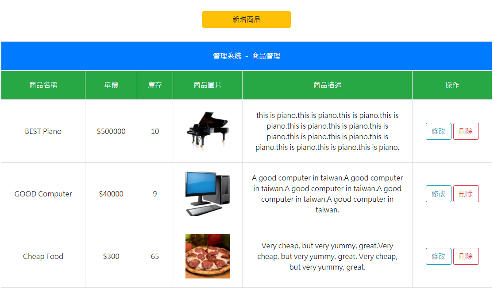

# PID-Assignment
## 管理端
### 訂單管理
1.修改訂單狀態為已完成或已取消 
2.查看訂單細節 

### 會員列表
1.修改會員狀態為正常或停權 
2.查看會員歷史訂單 
3.查看會員歷史訂單細節 

### 商品管理
1.新增商品 
2.修改商品 
3.刪除商品 

### 報表
1.查看日營收，可選擇區間 
2.查看月營收，可選擇區間 

## 會員端
### 註冊
1.所有欄位不得為空 
2.使用者代號不得與其他使用者重複 
3.電子信箱不得與其他使用者重複 
4.手機號碼不得與其他使用者重複 
5.密碼大於8個字元，需含大小寫字母與數字 

### 登入
只需使用者代號及密碼就能登入 

### 商品列表
1.可將商品加入購物車 
2.加入購物車時右上角的購物車圖示會同步購買數量 

### 查詢訂單
1.可查看歷史訂單 
2.可查看訂單狀態 
3.可查看歷史訂單細節 

### 購物車
1.可修改購買數量 
2.修改購買數量時右上角的購物車圖示會同步購買數量 
3.修改購買數量時金額會同步計算 
4.可刪除購買物品 
5.結帳時若庫存不足會購買失敗並給予提示 
